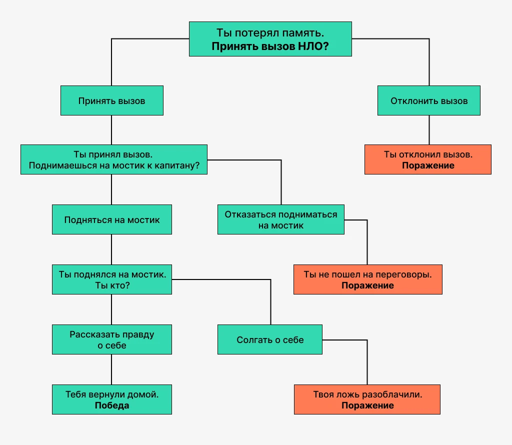

## Задание: написать небольшой текстовый квест. Вопрос на каждом следующем шаге зависит от предыдущего ответа.

Требования:

1. Это должен быть Maven проект с использованием таких технологий: сервлеты, jsp, jstl.
2. Для запуска при тестировании будет использоваться Tomcat 9, так что при разработке советую также использовать именно его.
3. После победы или поражения должна быть возможность начать игру заново.
4. Какая-то информация должна храниться в сессии. Это может быть имя игрока, количество сыгранных игр или еще что-то на твое усмотрение.

5. Логика должна быть покрыта тестами. Используй JUnit.
6. Опциональное требование: добавить страницу-приветствие, в которой написать текст приветствие, рассказывающий предысторию к этому текстовому квесту-игре.

7. Сделанный проект залить в свой репозиторий на GitHub.

Пример логики вопросов (вопросы можно использовать из примера или придумать что-то свое):

